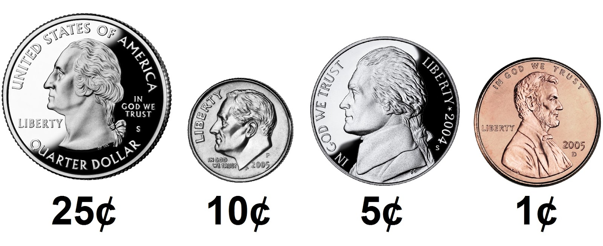

# CS50 - Science Computing - Cash



## Problem to Solve

Suppose you work at a store and a customer gives you $1.00 (100 cents) for candy that costs $0.50 (50 cents). You’ll need to pay them their “change,” the amount leftover after paying for the cost of the candy. When making change, odds are you want to minimize the number of coins you’re dispensing for each customer, lest you run out (or annoy the customer!). In a file called cash.c in a folder called cash, implement a program in C that prints the minimum coins needed to make the given amount of change, in cents, as in the below:

```bash
Change owed: 25
1
```
But prompt the user for an int greater than 0, so that the program works for any amount of change:
```bash
Change owed: 70
4
```
Re-prompt the user, again and again as needed, if their input is not greater than or equal to 0 (or if their input isn’t an int at all!).

## How to Test

For this program, try testing your code manually. It’s good practice:
```
    If you input -1, does your program prompt you again?
    If you input 0, does your program output 0?
    If you input 1, does your program output 1 (i.e., one penny)?
    If you input 4, does your program output 4 (i.e., four pennies)?
    If you input 5, does your program output 1 (i.e., one nickel)?
    If you input 24, does your program output 6 (i.e., two dimes and four pennies)?
    If you input 25, does your program output 1 (i.e., one quarter)?
    If you input 26, does your program output 2 (i.e., one quarter and one penny)?
    If you input 99, does your program output 9 (i.e., three quarters, two dimes, and four pennies)?
```