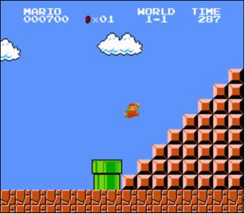

# Mario - Pyramid - less

Toward the end of World 1-1 in Nintendo’s Super Mario Bros., Mario must ascend right-aligned pyramid of bricks, as in the below.



In a file called mario.c in a folder called mario-less, implement a program in C that recreates that pyramid, using hashes (#) for bricks, as in the below:

```
       #
      ##
     ###
    ####
   #####
  ######
 #######
########
```

But prompt the user for an int for the pyramid’s actual height, so that the program can also output shorter pyramids like the below:

```
    #
   ##
  ###

```

## How to Test

Does your code work as prescribed when you input:

    -1 or other negative numbers?
    0?
    1 or other positive numbers?
    letters or words?
    no input at all, when you only hit Enter?
